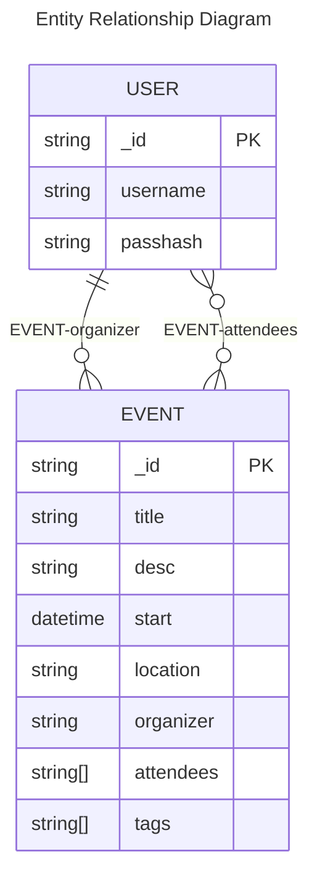

# Documentation

## Data

### Entity Relationship Diagram

```mermaid
---
title: Entity Relationship Diagram
---
erDiagram
    USER {
        string _id PK
        string username
        string passhash
    }
    EVENT {
        string _id PK
        string title
        string desc
        datetime start
        string location
        string organizer
        string[] attendees
        string[] tags
    }
    USER ||--o{ EVENT : EVENT-organizer
    USER }o--o{ EVENT : EVENT-attendees
```
