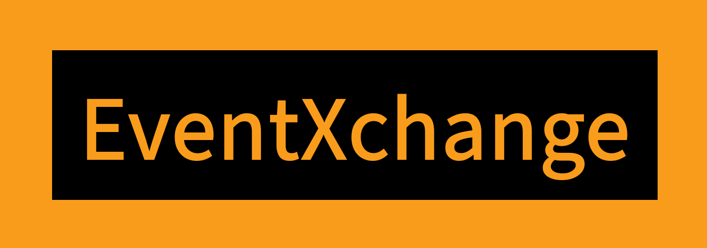

## Team Orange Bytes

- [BrettK (Brett Kinnamon)](https://github.com/brettk-dev)
- [_breee (Brecon N)](https://github.com/breconm)
- [Sage (Khalil A)](https://github.com/khalil-alexander)
- [LittleInksmith (Zaynab JC)](https://github.com/curiousConductor49)
- [Keith (Keith Miquela)](https://github.com/keithmiquela)
- [dfdx2 (D Davis)](https://github.com/dfdx2)
- [robynbee (Robyn B)](https://github.com/RBodde)
- [Tailsmonster (Nico Aroca)](https://github.com/tailsmonster)
- [Vessel](https://github.com/VesselOfSouls)
- [Jolene (JoleneKearse)](https://github.com/JoleneKearse)

## Project Overview
Created for the fCC 2025 Summer Hackathon, EventXchange is a community-based app centred around connecting you with amazing events hosted by like-minded individuals. Users can create, delete, and schedule events at their creative leisure, as well RSVP to other users' events.

## Tech Stack
This project uses the MERN (MongoDB, Express, React, Node) stack and npm for the package manager.

## Usage

### Local Setup
1. Clone the Git repository.
```git clone git@github.com:freeCodeCamp-2025-Summer-Hackathon/EventXchange.git```
2. Install front-end and back-end dependencies.
```npm run deps```

### Environment Variables
1. Create and connect to a MongoDB Atlas cluster.
2. Navigate from root folder to server folder.
```cd server```
3. Create env file with two variables: DB_URI and SESSION_SECRET
4. Populate the seed database.
```npm run seed```

## Contributing
Pull requests are welcome. For major changes, please open an issue first to discuss what you would like to change.

### Project status
Ongoing! Some planned features like notifications and updating created events have yet to be implemented.

### Old mockups and wireframes
- Rough Sketch: https://excalidraw.com/#json=jxTLV8Jnf0G45iMDcRRYu,i5uVK75gG2UmX6Xb-8dB1g
- Figma Mobile (WIP): https://www.figma.com/design/jYKycq5U5WoMBXDWM5BbVk/Mobile-hack?node-id=0-1&p=f&t=qUnoX9l6LMIYF8KW-0
- Figma Desktop (completed but needs revamp): https://www.figma.com/design/hGKM6D7L3epNyxRd8ZZxqJ/Desktop-Hack?node-id=0-1&t=EeToU8s7I24jKhyh-1
- Wireframes: https://www.figma.com/design/os1dVulAXBquuCH8B7XpQJ/EventXchange-Wireframing?node-id=0-1&t=z1Kth1KIVs4SR2n6-1

### License
[MIT](https://choosealicense.com/licenses/mit/)

## Acknowledgement
Thank you to freeCodeCamp for hosting this Hackathon!